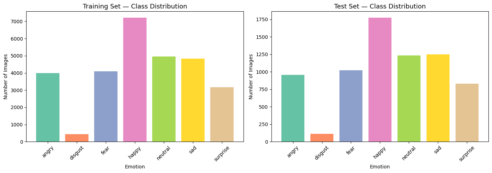
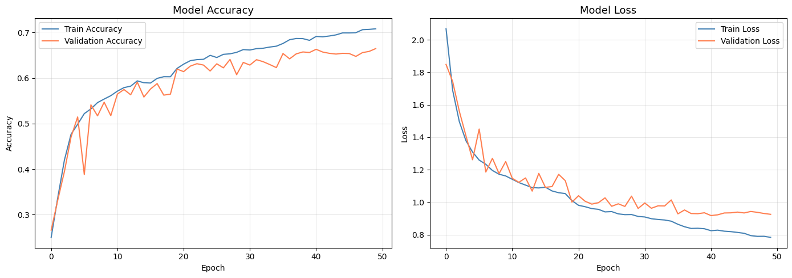
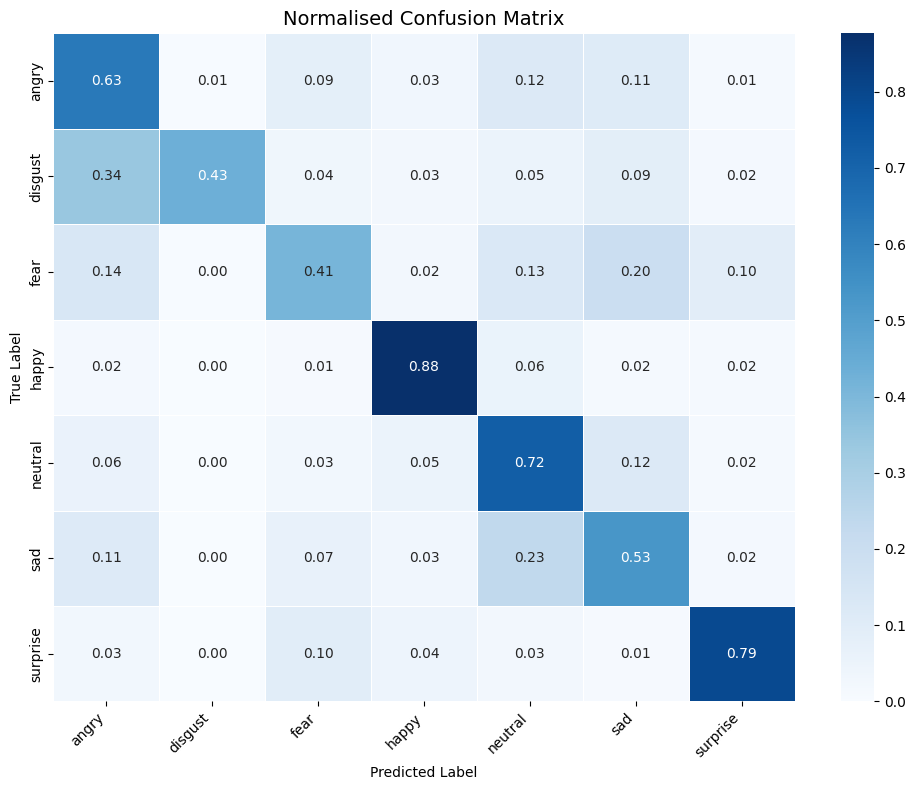
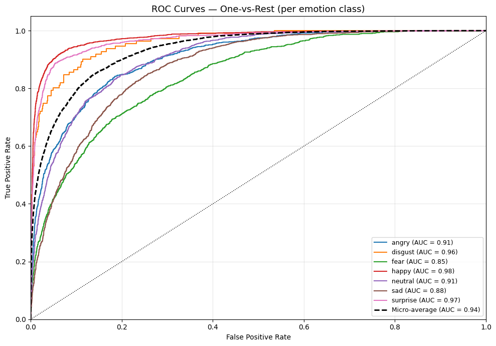

# Student Engagement Detection via Facial Emotion Recognition

An end-to-end Machine Learning pipeline that detects student engagement levels
from facial expressions using a CNN trained on the **FER+** dataset.

| | Link |
|---|---|
| **YouTube Demo** | [Watch on YouTube](https://youtu.be/K0KmT2JrtDk) |
| **Live UI** | [akach1-student-engagement-ui.hf.space](https://akach1-student-engagement-ui.hf.space) |
| **Live API** | [akach1-student-engagement-api.hf.space](https://akach1-student-engagement-api.hf.space) |
| **API Docs** | [/docs](https://akach1-student-engagement-api.hf.space/docs) |

---

## Project Description

This system classifies facial images into 8 emotion categories
(Angry, Contempt, Disgust, Fear, Happy, Neutral, Sad, Surprise)
and maps them to engagement levels — giving educators a real-time
signal of how students are responding during a lesson.

It extends a previous student-performance prediction project (tabular data)
into the image domain.

**Tech stack:** TensorFlow/Keras · FastAPI · Streamlit · Docker · Locust

---

## Directory Structure

```
summative_mlop/
├── README.md
├── requirements.txt
├── notebook/
│   └── student_engagement.ipynb   ← full EDA + training + evaluation
├── src/
│   ├── preprocessing.py           ← image loading, resizing, augmentation
│   ├── model.py                   ← CNN architecture + training function
│   └── prediction.py              ← load model, infer single image
├── api/
│   ├── main.py                    ← FastAPI app (5 endpoints)
│   └── retrain.py                 ← background retraining worker
├── ui/
│   └── app.py                     ← Streamlit dashboard (3 pages)
├── tests/
│   └── locustfile.py              ← Locust load test
├── data/
│   ├── train/                     ← training images (one sub-folder per class)
│   └── test/                      ← test images
├── models/
│   └── emotion_model.h5           ← saved Keras model (after training)
├── Dockerfile
└── docker-compose.yml
```

---

## Setup Instructions

### Prerequisites
- Python 3.10+
- Docker + Docker Compose (optional but recommended)
- FER+ dataset placed in `data/` (see below)

### 1. Clone the repository

```bash
git clone <your-repo-url>
cd summative_mlop
```

### 2. Install dependencies

```bash
pip install -r requirements.txt
```

### 3. Place the dataset

Download the FER+ dataset and arrange it as follows:

```
data/
├── train/
│   ├── Angry/        ← .png images
│   ├── Contempt/
│   ├── Disgust/
│   ├── Fear/
│   ├── Happy/
│   ├── Neutral/
│   ├── Sad/
│   └── Surprise/
└── test/
    └── <same structure>
```

### 4. Train the model (notebook)

Open and run every cell in the notebook:

```bash
jupyter notebook notebook/student_engagement.ipynb
```

This saves the best model to `models/emotion_model.h5`.

Alternatively, train from the command line:

```bash
python src/model.py \
    --train_dir data/train \
    --test_dir  data/test  \
    --model_path models/emotion_model.h5 \
    --epochs 50
```

### 5. Start the API

```bash
uvicorn api.main:app --reload --host 0.0.0.0 --port 8000
```

Interactive docs available at http://localhost:8000/docs

### 6. Start the UI

```bash
streamlit run ui/app.py
```

Dashboard available at http://localhost:8501

### 7. Run everything with Docker

```bash
docker-compose up --build
```

| Service | URL |
|---------|-----|
| FastAPI | http://localhost:8000 |
| Streamlit | http://localhost:8501 |
| API Docs | http://localhost:8000/docs |

---

## API Endpoints

| Method | Endpoint | Description |
|--------|----------|-------------|
| `GET`  | `/health` | Model status, uptime, last trained timestamp |
| `GET`  | `/metrics` | Accuracy + class distribution stats |
| `POST` | `/predict` | Upload an image → emotion + confidence |
| `POST` | `/upload-data` | Bulk image upload (zip or labelled files) |
| `POST` | `/retrain` | Trigger background model retraining |

---

## Load Testing (Locust)

```bash
# Web UI mode
locust -f tests/locustfile.py --host=http://localhost:8000

# Headless mode (100 users, 60 s)
locust -f tests/locustfile.py \
       --host=http://localhost:8000 \
       --headless \
       --users 100 \
       --spawn-rate 10 \
       --run-time 60s
```

### Results

| Users | Req/s | Median (ms) | 95th % (ms) | Failures |
|-------|-------|-------------|-------------|----------|
| 10    | 4.17  | 310         | 1100        | 0        |
| 50    | 15.81 | 630         | 1400        | 0        |
| 100   | 17.53 | 2500        | 5800        | 0        |

*Tested against the live HF Spaces API. The API handles up to 50 concurrent users with sub-1.5s 95th-percentile latency and 0 failures. At 100 users, throughput plateaus (~17.5 req/s) and latency rises significantly due to the free-tier HF Spaces CPU constraint.*

---

## Model Architecture

```
EmotionCNN
├── Block 1: Conv2D(64)×2  → BatchNorm → MaxPool → Dropout(0.25)
├── Block 2: Conv2D(128)×2 → BatchNorm → MaxPool → Dropout(0.25)
├── Block 3: Conv2D(256)×2 → BatchNorm → MaxPool → Dropout(0.40)
└── Head:    Flatten → Dense(512) → BatchNorm → Dropout(0.50)
                     → Dense(256) → Dropout(0.30)
                     → Dense(8, softmax)
```

Input: 48×48×1 (grayscale) · Output: 8-class softmax
Optimizer: Adam (lr=1e-3) · Loss: Categorical Cross-Entropy

---

## Visualisations

### Sample Images per Emotion Class


### Class Distribution (Training Set)


### Training Curves


### Confusion Matrix


### ROC Curves


---

## Engagement Mapping

| Emotion | Engagement Level |
|---------|-----------------|
| Happy | Engaged |
| Surprise | Attentive |
| Neutral | Passive |
| Sad / Angry / Disgust | Disengaged |
| Fear | Anxious |
| Contempt | Uninterested |

---

## License

For academic use only — university assignment submission.
